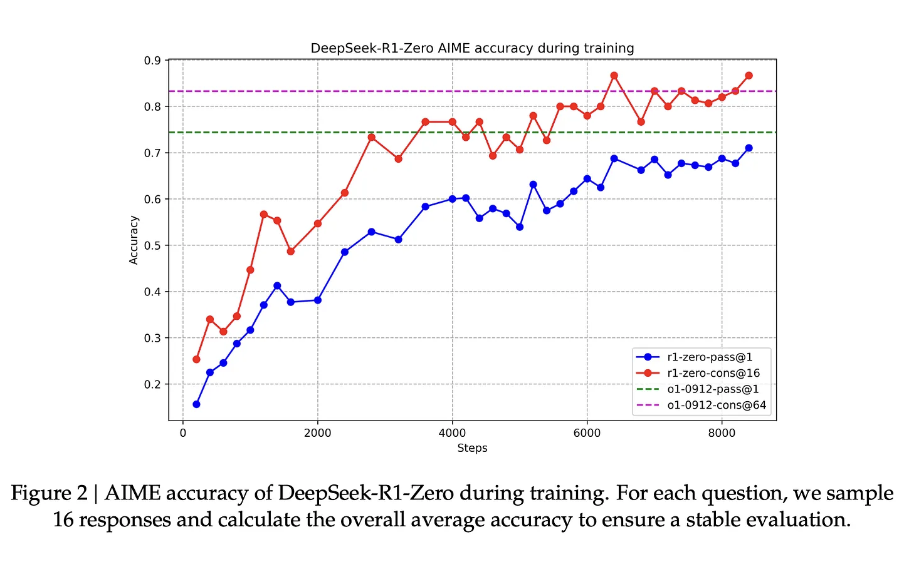

## research

 

- [week #1](#week-1)

 

---

### week #1

 

#### defai and decentralized training

 

* [deai – part 1: exiting the matrix](https://www.bigbrain.holdings/post/deai-part1-exiting-the-matrix/) and [deai - part 2: decentralized training](https://www.bigbrain.holdings/post/dai-part2-decentralized-training/)
* [the past, present, and future of decentralized training](https://www.symbolic.capital/writing/frontier-training)
* [the state of art of decentralized training](https://www.primeintellect.ai/blog/our-approach-to-decentralized-training)
* [gpt@home: why the future of training is decentralized, by j. amico](https://www.gensyn.ai/articles/gpt-at-home)

 

 

#### scaling and agi

 

* [the scaling hypothesis](https://gwern.net/scaling-hypothesis)

 

#### distillation in llms

 

* [deepseek r1 recipe for o1](https://www.interconnects.ai/p/deepseek-r1-recipe-for-o1)
* [distillation in llm](https://www.datacamp.com/blog/distillation-llm)
* [RL backlog: OpenAI's many RLs, clarifying distillation, and latent reasoning](https://www.interconnects.ai/p/rl-backlog-openais-many-rls-clarifying)

 

 

#### decentralized training papers

 

* [swarm parallelism: training large models can be surprisingly communication-efficient](https://arxiv.org/pdf/2301.11913)
* [deepmind's diloco: distributed low-communication training of language models](https://arxiv.org/pdf/2311.08105)
* [decentralized training of foundation models in heterogeneous environments](https://arxiv.org/pdf/2206.01288)
* [deepmind's dipaco: distributed path composition](https://arxiv.org/pdf/2403.10616)
* [towards crowdsourced training of large neural networks using decentralized mixture-of-experts](https://arxiv.org/pdf/2002.04013)
* [lo-fi: distributed fine-tuning without communication](https://arxiv.org/pdf/2210.11948)
* [the future of large language model pre-training is federated](https://arxiv.org/abs/2405.10853v2)

 

#### ml on blockchain

 

* [opML: Optimistic Machine Learning on Blockchain](https://arxiv.org/pdf/2401.17555)

 

#### parallel training techniques

 

* [a deep dive into 3d parallelism with nanotron](https://tj-solergibert.github.io/post/3d-parallelism/)
* [asynchronous local-sgd training for language modeling](https://arxiv.org/pdf/2401.09135)
* [model-agnostic meta-learning for fast adaptation of deep networks](https://arxiv.org/pdf/1703.03400)

 

---
