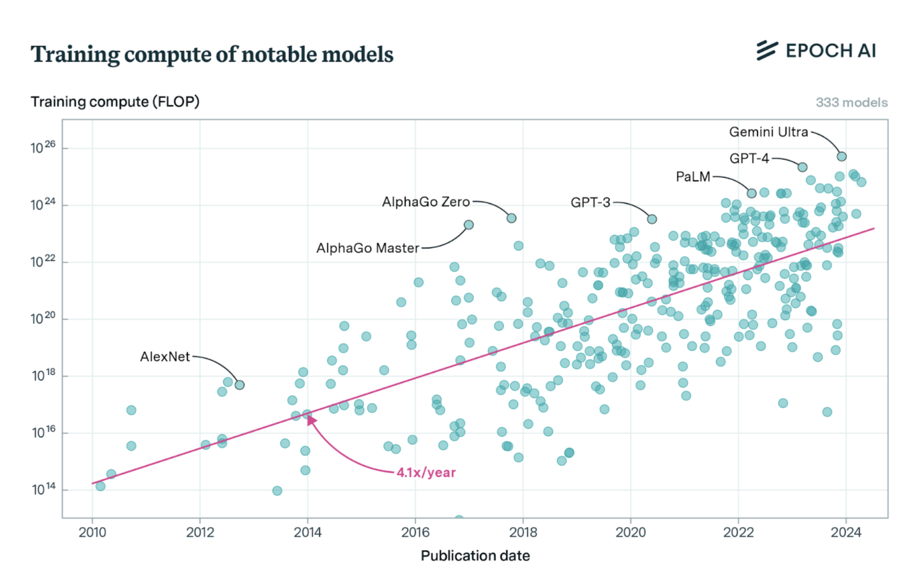
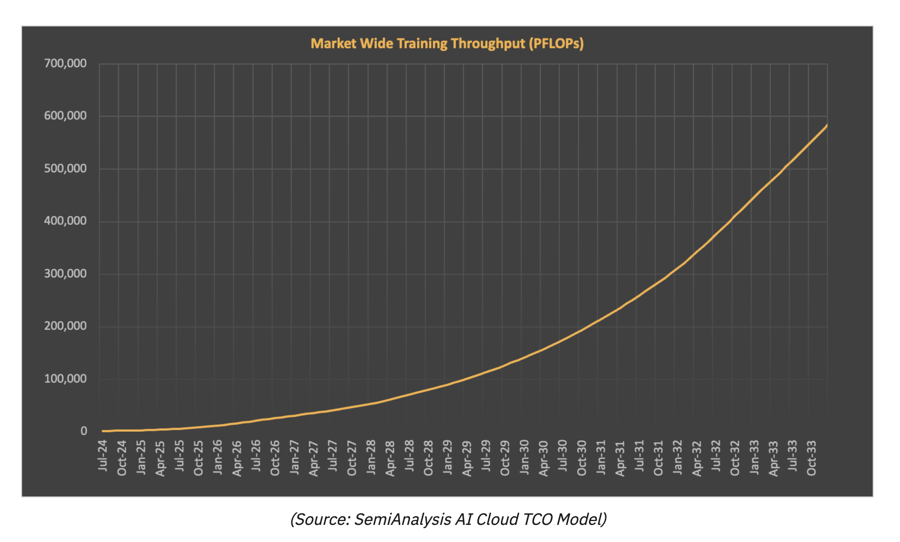

# decentralized (and distributed) ai (deai) studies

<br>

## 影森 content

<br>

- [🌲 distributed and decentralized training](#🌲-distributed-and-decentralized-training)
- [🌲 training architectures](#🌲-training-architectures)
  - [diloco](#diloco)
  - [open diloco](#open-diloco)
  - [distro](#distro)
  - [demo](#demo)
  - [swarm parallel](#swarm-parallel)
- [🌲 training tools and techniques](#🌲-training-tools-and-techniques)
  - [libraries](#libraries)
  - [fine-tuning](#fine-tuning)
    - [reinforcement learning from human feedback (rlhf)](#reinforcement-learning-from-human-feedback-rlhf)
    - [direct preference optimization (dpo)](#direct-preference-optimization-dpo)
- [🌲 models](#🌲-models)
  - [deepseek](#deepseek)
  - [anthropic](#anthropic)
- [🌲 ml on blockchains](#🌲-ml-on-blockchains)
- [🌲 security and sybil resistance](#🌲-security-and-sybil-resistance)
  - [zero-knowledge machine learning (zkml)](#zero-knowledge-machine-learning-zkml)
  - [fully homomorphic encryption (fhe)](#fully-homomorphic-encryption-fhe)
  - [trusted execution environments (tees)](#trusted-execution-environments-tees)
  - [verifiable compute](#verifiable-compute)
- [🌲 infra, hardware and costs](#🌲-infra-hardware-and-costs)
- [🌲 delightful essays](#🌲-delightful-essays)

<br>

---

## 🌲 distributed and decentralized training

<br>

- [aegaeon: effective gpu pooling for concurrent llm serving on the market, by xiang et al. (2025)](https://ennanzhai.github.io/pub/sosp25-aegaeon.pdf)
  - model auto-scaling at the token granularity for effective gpu pooling
  - schedules multi-model requests and makes auto-scaling decisions on a per-token basis (token-level auto-scaling solution)
  - reduces auto-scaling overhead by 97% through component reuse, explicit memory management, and fine-grained KV cache synchronization
  - memory fragmentation when storing KV cache of several different shapes: slab allocation to build unified KV caches for every possible
shape (every KV cache region - VRAM or DRAM- is divided into fixed-size chunks/slabs)
- [deai – part 1: exiting the matrix](https://www.bigbrain.holdings/post/deai-part1-exiting-the-matrix/) and [deai - part 2: decentralized training](https://www.bigbrain.holdings/post/dai-part2-decentralized-training/)
- [the past, present, and future of decentralized training](https://www.symbolic.capital/writing/frontier-training):
  - <i>"decentralized ai training faces three critical hurdles: technical feasibility, achieving trustless and private handling of data and model weights, and scaling networks to compete with centralized solutions."</i>
  - <i>"if we continue with this centralized approach, the only way forward will be to build ever-larger data centers, adding more compute power and investing heavily in advanced networking to avoid bottlenecks. but it's unclear if this model of scaling will even hold."</i>
- [the state of the art of decentralized training](https://www.primeintellect.ai/blog/our-approach-to-decentralized-training)
- [gpt@home: why the future of training is decentralized, by j. amico](https://www.gensyn.ai/articles/gpt-at-home)
- [the scaling hypothesis](https://gwern.net/scaling-hypothesis)

<br>

### determinism and reproducibility

<br>

- [defeating nondeterminism in llm inference, by thinking machines (2025)](https://thinkingmachines.ai/blog/defeating-nondeterminism-in-llm-inference/)
- [three solutions to nondeterminism in ai, by hellas (2025)](https://blog.hellas.ai/blog/three-solutions-to-nondeterminism-in-ai/)
  - verification through dealing with floating-point non-associativity, remove floating-point calculations from models entirely, and verifying tasks directly.
- [towards deterministic inference in sglang and reproducible rl training, by the sglang team (2025)](https://lmsys.org/blog/2025-09-22-sglang-deterministic/)
  - claim of fully deterministic inference while maintaining compatibility with chunked prefill, CUDA graphs, radix cache, and non-greedy sampling.
  - validation experiments on qwen3-8b with full reproducibility: two independent training runs produce identical curves.
- [deep learning determinism, by d. riach (2019)](https://www.youtube.com/watch?v=TB07_mUMt0U)
  - old but good; debugging non-determinism on gpus and tensorflow 

<br>

#### just a bunch of [bittensor](https://github.com/opentensor/bittensor) projects for arxiv (with no preference, order, or endorsement)

- [taostats.io](https://taostats.io)
- [taohash.ai](https://taohash.ai/)
- [chutes.ai](https://chutes.ai/)
- [zeussubnet.com](https://www.zeussubnet.com/)
- [masa.ai](https://github.com/masa-finance/masa-bittensor)
- [quantum bittensor](https://x.com/qBitTensorLabs)
- [focus.inc](https://www.focus.inc/)
- [macrocosmos.ai](https://www.macrocosmos.ai/)
- [neuralinternet.ai](https://neuralinternet.ai/)
- [nineteen.ai](https://nineteen.ai/)
- [gaiaresearch.ai](https://www.gaiaresearch.ai/)
- [tensorplex.ai](https://tensorplex.ai/)
- [infinitegam.es](https://www.infinitegam.es/)
- [sturdy.finance](https://sturdy.finance/)
- [storb.dev](https://storb.dev/)
- [metahash73.com](https://metahash73.com/)
- [subvortex.com](https://www.subvortex.com/)
- [inferencelabs.com](https://inferencelabs.com/)
- [bitmind.ai](https://bitmind.ai/)
- [computehorde.io](https://computehorde.io/)
- [vidaio.io](https://vidaio.io/)
- [candlestao](https://candlestao.com/)
- [on layerzero](https://x.com/LayerZero_Core/status/1923376914951295385)
- [chain of thought on bittensor](https://chainofthought.xyz/t/%F0%9F%94%B1%20Bittensor)

<br>

---

## 🌲 training architectures

<br>

### decentralized training

<br>

- [swarm parallelism: training large models can be surprisingly communication-efficient](https://arxiv.org/pdf/2301.11913)
- [deepmind's diloco: distributed low-communication training of language models](https://arxiv.org/pdf/2311.08105)
- [decentralized training of foundation models in heterogeneous environments](https://arxiv.org/pdf/2206.01288)
- [deepmind's dipaco: distributed path composition](https://arxiv.org/pdf/2403.10616)
- [towards crowdsourced training of large neural networks using decentralized mixture-of-experts](https://arxiv.org/pdf/2002.04013)
- [lo-fi: distributed fine-tuning without communication](https://arxiv.org/pdf/2210.11948)
- [the future of large language model pre-training is federated](https://arxiv.org/abs/2405.10853v2)

<br>





<br>

---

### diloco

<br>

> <i>diloco (distributed low-communication) is a training approach that minimizes communication overhead between distributed nodes.</i>

<br>

- [deepmind's diloco: distributed low-communication training of language models](https://arxiv.org/pdf/2311.08105)

<br>

---

### open diloco

<br>

> <i>open diloco extends the diloco approach with open-source implementations and community-driven improvements.</i>

<br>

- [prime intellect's opendiloco: an open-source framework for globally distributed low-communication training](https://arxiv.org/pdf/2407.07852)
- [a preliminary report on distro](https://github.com/nousresearch/distro/blob/main/a_preliminary_report_on_distro.pdf)

<br>

---

### distro

<br>

> <i>distro (distributed training optimization) focuses on optimizing distributed training workflows and resource utilization.</i>

<br>

- [distro: distributed training optimization](https://github.com/nousresearch/distro)

<br>

---

### demo

<br>

> <i>demo (decentralized model) emphasizes decentralized model training and deployment strategies.</i>

<br>

- [demo: decoupled momentum optimization](https://arxiv.org/pdf/2411.19870)

<br>

---

### swarm parallel

<br>

> <i>swarm parallel enables parallel training across multiple nodes with efficient resource allocation and synchronization.</i>

<br>

- [swarm parallelism: training large models can be surprisingly communication-efficient](https://arxiv.org/pdf/2301.11913)

<br>

---

## 🌲 training tools and techniques

<br>

### libraries

<br>

- [ray compute engine](https://github.com/ray-project/ray): ai compute engine. ray consists of a core distributed runtime and a set of ai libraries for accelerating ml workloads
- [deepspeed](https://github.com/deepspeedai/deepspeed): deep learning optimization library that makes distributed training and inference easy, efficient, and effective

<br>

---

### fine-tuning

<br>

- [kiln](https://github.com/kiln-ai/kiln)
- [unsloth](https://github.com/unslothai/unsloth)
- [llama3.2_finetuning](https://github.com/shubhamsaboo/awesome-llm-apps/tree/main/llm_finetuning_tutorials/llama3.2_finetuning)
- [nousresearch's bittensor fine-tuning subnet](https://github.com/nousresearch/finetuning-subnet?tab=readme-ov-file), [gradient.io](https://gradients.io/),
- [openai's guide](https://platform.openai.com/docs/guides/fine-tuning)
- [x-box](https://github.com/Nim-Network-Foundation/X-box)

<br>


<br>

#### reinforcement learning from human feedback (rlhf)

<br>

- [nathan lambert's rlhf book](https://rlhfbook.com/)
  - <i>"the most compelling view of how rlhf works is to think of how style applies to interactions you have with language models"</i>

<br>

#### direct preference optimization (dpo)

<br>

> <i>dpo is a method for fine-tuning language models that directly optimizes for human preferences without requiring reinforcement learning.</i>

<br>

---

## data

<br>


<br>

### videos

<br>

- [optimize RAG with AI agents & vector databases](https://www.youtube.com/watch?v=Yq29bZ8Hlrc)

<br>

### distributed inference

<br>

- [parallax: efficient distributed llm inference on heterogeneous hardware, by tong et al. (2025)](https://gradient.network/parallax.pdf)
  - distributed inference framework that runs llms seamlessly across heterogeneous, decentralized hardware (p2p-based pipeline parallelism)
stages are mapped directly to nodes in a peer-to-peer network)
  - high-throughput, low-latency serving for geographically dispersed devices based on pipeline parallelism, through dynamic KV-cache management, continuous batching, and optimized kernels
  - 3.1x reduction in end-to-end latency, 5.3x improvement in intertoken latency, and 3.1x higher throughput compared to state-of-the-art baseline

<br>

---

## 🌲 models

<br>

### deepseek

<br>

- [awesome-deepseek-integration](https://github.com/deepseek-ai/awesome-deepseek-integration)

<br>

#### r1

<br>

> <i>"deepseek r1 zero will be best known as the first open model trained with 'large-scale reinforcement learning (rl) without supervised fine-tuning (sft) as a preliminary step'."</i> - nathan lambert

<br>

- [deepseek-r1](https://github.com/deepseek-ai/deepseek-r1) ([ollama](https://ollama.com/library/deepseek-r1))
- [light-r1](https://github.com/qihoo360/light-r1)
- [open-r1](https://github.com/huggingface/open-r1)
- [train-deepseek-r1](https://github.com/fareedkhan-dev/train-deepseek-r1)

<br>

#### v3

<br>

- [deepseek-v3](https://github.com/deepseek-ai/deepseek-v3)

<br>

#### distillation in llms

<br>

- [deepseek r1 recipe for o1](https://www.interconnects.ai/p/deepseek-r1-recipe-for-o1)
- [distillation in llms](https://www.datacamp.com/blog/distillation-llm)
- [rl backlog: openai's many rls, clarifying distillation, and latent reasoning](https://www.interconnects.ai/p/rl-backlog-openais-many-rls-clarifying)

<br>


<br>

---

### anthropic

<br>

- [anthropic](https://www.anthropic.com/)
- [anthropic-cookbook](https://github.com/anthropics/anthropic-cookbook)

<br>

---

## 🌲 ml on blockchains

<br>

- [opml: optimistic machine learning on blockchain](https://arxiv.org/pdf/2401.17555)
- [decentralized machine learning: fundamentals, state of the art, and future directions](https://arxiv.org/abs/2401.17555)
- [blockchain-based federated learning: a comprehensive survey](https://arxiv.org/abs/2401.17555)

<br>

---

## 🌲 security and sybil resistance

<br>

> <i>to ensure valid participation in a decentralized training network, we need to leverage applied cryptography to verify that computation has been done correctly during training.</i>

<br>

---

### zero-knowledge machine learning (zkml)

<br>

> <i>zero-knowledge machine learning has been used to attest to the performance of a model without revealing the model's underlying weights.</i>

<br>

- [ezkl](https://github.com/zkonduit/ezkl): engine for doing inference for deep learning models and other computational graphs in a zk-snark ([python notebooks](https://github.com/zkonduit/ezkl/tree/main/examples/notebooks))

<br>

---

### fully homomorphic encryption (fhe)

<br>

> <i>the holy grail of privacy-preserving computation, fhe allows for computation on encrypted data. however, to date, pre-training on encrypted data has simply been unfeasible.</i>

<br>

---

### trusted execution environments (tees)

<br>

> <i>tees are much more computationally efficient: model weights could be held and processed in tees to ensure privacy without introducing significant overhead. however, they are only present on specialized hardware.</i>

<br>

---

### verifiable compute

<br>

- [prime intelect's toploc](https://www.primeintellect.ai/blog/toploc)

<br>

---

## 🌲 infra, hardware, and costs

<br>

- [building an efficient gpu server with nvidia geforce rtx 4090s/5090s](https://a16z.com/building-an-efficient-gpu-server-with-nvidia-geforce-rtx-4090s-5090s/)
- [the new AI infrastructure stack part I, by devansh](https://artificialintelligencemadesimple.substack.com/p/the-gpu-monopoly-is-over-the-new)
- [compute, the new primitive, by t. yan](https://chainofthought.xyz/p/big-idea-2-compute-the-new-primitive)

<br>


<br>

---

### costs

<br>

```
centralized training's cost of compute = training cost

decentralized training's cost of compute * decentralization multiplier
```

<br>

---

## 🌲 delightful essays

<br>

- [x explains z% of the variance in y, by l. lang](https://www.lesswrong.com/posts/E3nsbq2tiBv6GLqjB/x-explains-z-of-the-variance-in-y)
- [mental frameworks for AI & crypto, by t. yan](https://chainofthought.xyz/p/mental-frameworks-for-ai-crypto)
