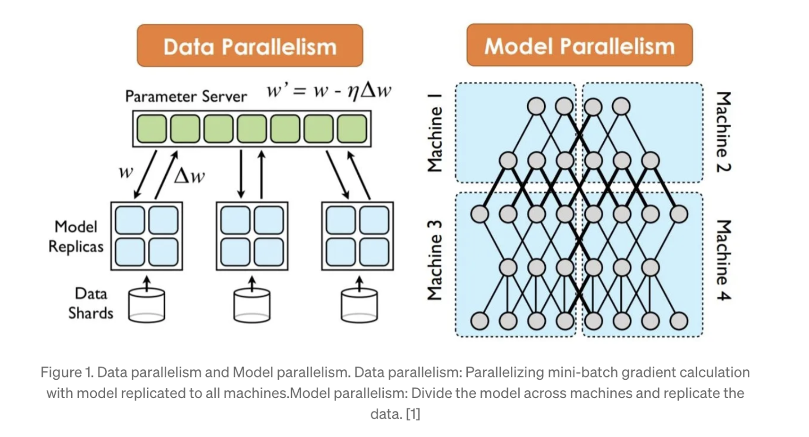

# glossary

 

> <i>deai reduces the communication overhead of 3d parallelism enough to achieve training in a feasible time and in a distributed manner.</i>

 

---

## 🌲 basic terms

 

- <b>backpropagation</b>: updating model weights using gradient descent
- <b>loss calculation</b>: measuring prediction error numerically
- <b>weights</b>: numerical parameters in transformer models
- <b>temperature</b>: controls output randomness and creativity
- <b>learning rate</b>: step size for weight updates
- <b>pretraining</b>: initial training on general language data
- <b>fine-tuning</b>: adapting model for specific tasks
- <b>few-shot learning</b>: learning from minimal examples
- <b>layers</b>: transformer architecture components
- <b>federated learning</b>: distributed training with privacy

 

--- 

## 🌲 parallelism

 

 

- <b>data parallelism</b>: identical model copies across devices, each processing different data batches. requires full model storage per device, limiting scalability for large models.

- <b>tensor parallelism</b>: splits model tensors across devices, with each handling partial operations. reduces memory needs but requires frequent device communication.

- <b>pipeline parallelism</b>: distributes model layers across devices in sequence. reduces per-device memory but can cause idle time between stages.

- <b>3d parallelism</b>: combines data, tensor, and pipeline parallelism for large models. enables training of massive models like nvlm (70.5b parameters) through frameworks like megatron-lm.

 

---
